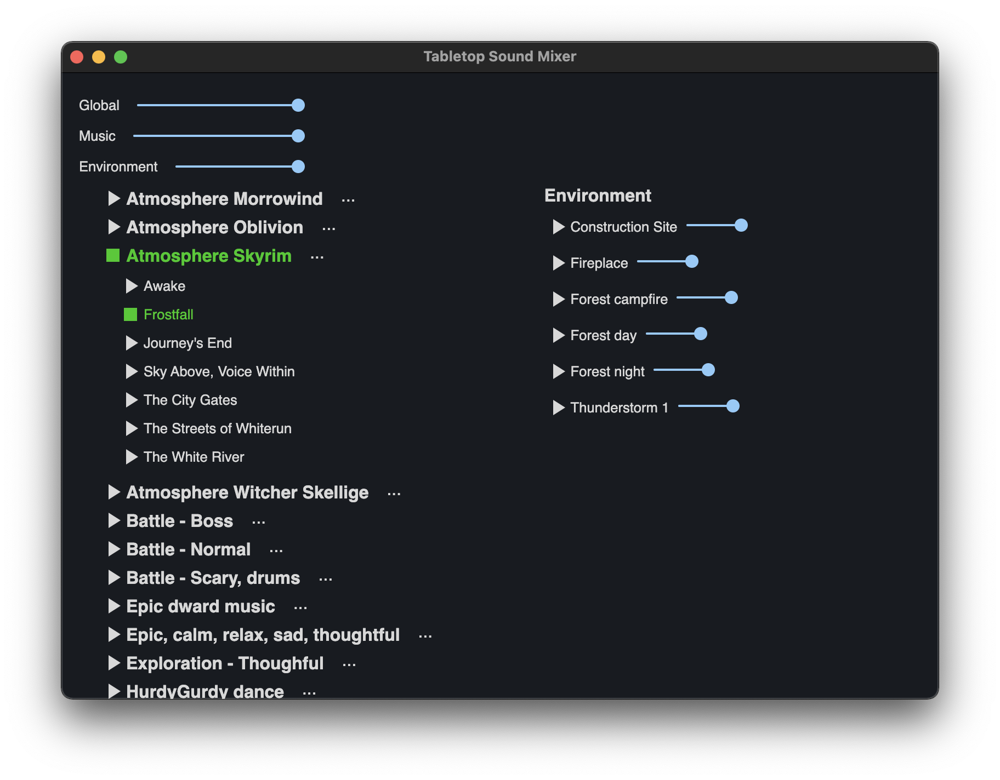
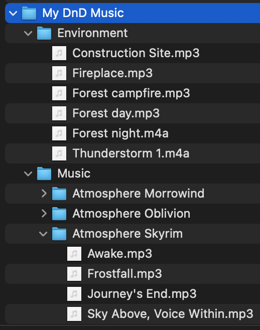
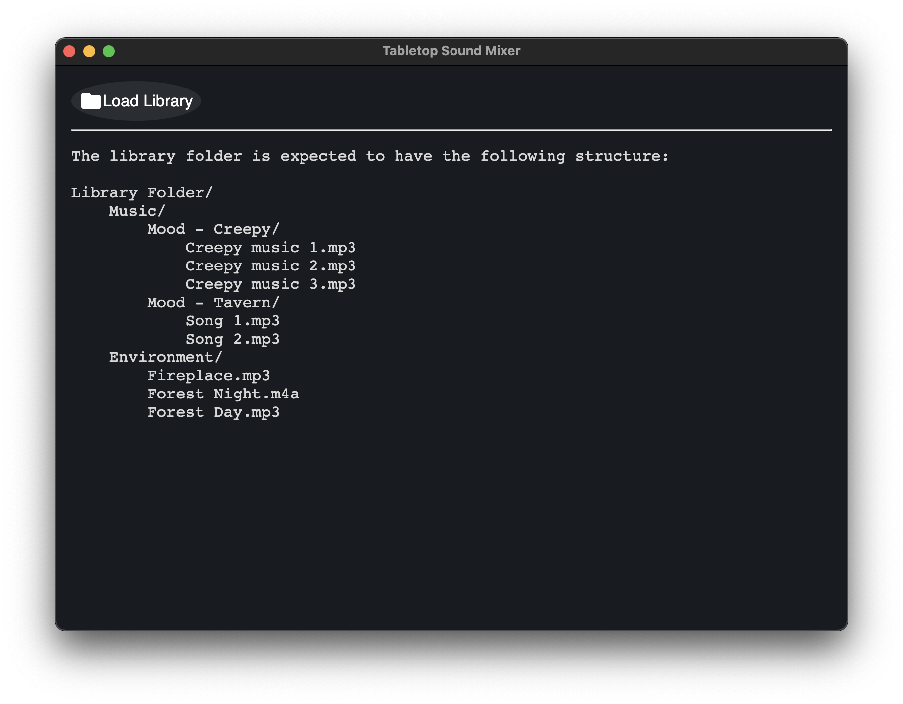

# Tabletop Sound Mixer

This is a very basic and simple tool that allows game master (GM) to mix the audio:

- to create a specific mood using **music playlists**
- and to use **environment sounds** to make it even more immersive.

## How does it work

1. Create a folder structure with the audio files like this:

    

2. Run the app:

    

3. Load the folder that you have created:

    

4. Select playlist or specific music file to play and mix it with the environment audio.

# FAQ

## Do I need to build the audio library by myself?

Yes, this is the philosophy that this application follows.

There are other tools that provide cool predefined audio presets. But this tool is built with the idea in mind that you as a GM likely know your game better than anybody else who construct the generic audio library.

With that, it is up to you to construct the library.

## User interface could be better.

Indeed. If you're familiar with the tech stack that is used here (Typescript, node, React, webpack), your patches are welcomed!
